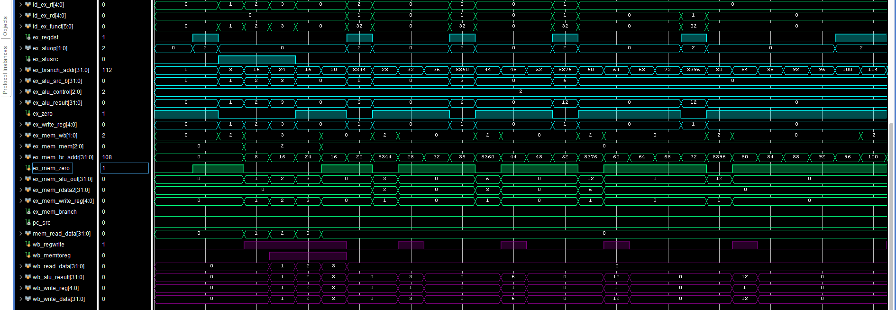
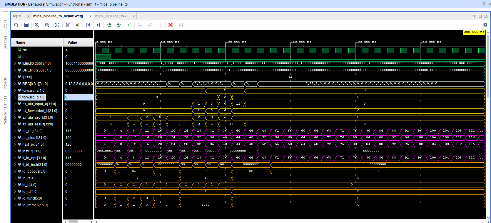

# ECE 4300 Coding Assignment 5: The Full Pipeline

mips_pipeline_tb.v - The base testbench that starts the clock, reset, and pulls the reg values at the end of the process to the terminal.    

REG - The single white section near the top showcases that the instructions went through the full pipeline.  
LATCHES - Our green waves contains the clock cycle, reset, and latch sections between pipline stages.    

instr.txt - instructions and values fed to the PipeLine Process  
data.txt - memory that is read on startup for the registers  

# Part 1: Instruction Fetch - Pink Section

top.v - 4 top modules mended together, wires everything together through the entire pipeline. Is a combination of 4 different top modules from across the past month from top.v, Decoder.v, Execute.v, MemAndWB.v  
ifIdLatch.v - passes on the output of incrementer.v and instrMem.v on every clock cycle   
incrementer.v - increments the output address of pc.v by 4 on every clock cycle   
instrMem.v - grabs the instr.txt, initializes an array of 2^10 32-bit registers, populates the necesarry entries with instructions, then outputs the data from an input address from pc.v on every clock cycle.   
mux.v - simple 2x1 mux, uses the ex_mem_pc_src input to select between passing on the address to branch to or the next address in the sequence.  
pc.v - program counter, simply forwards the next address from the mux.  

# Part 2: Decoder - Orange Section

control.v - This segment interprets the wb, mem, ex signals and generates signals for them.  
idExLatch.v - Acts as register for the the pipeline between the ID and EX stages.  
signExt.v - Preforms a sign extension which increases the bits needed for the 16 bit input.  
regfile.v - Register file that stores 32 bits in MIPS and writes registers.  

# Part 3: Execute - Blue Section

Adder.v - 32 bit adder  
Alu.v - performs arithmetic operations based on alu control  
Alu_Control.v - tells the ALU what operation to perform  
Ex_Mem_latch.v - passes the output onto the next stage  

# Part 4: Memory and Writeback - Purple Section

WBMux.v - Write back stage multiplexer  
and.v - and module comparing membranch and zero  
data_memory.v - module containing the program's memory and read/write functionality  
mem_wb.v - output latch  

  
  
   

# ECE 4300 Coding Assignment 6: Optimization

The top.v file was modified to include a data forwarding module into the MIPS Pipeline. 
This segment skips the writeback stage by pulling the data from the EX/MEM and MEM/WB latches and pushing them directly into the ALU for direct outputs.
In the yellow portion below, the ALU is shown to push the calculations to the REG wires while the writeback stage is still in progress.
As seen in the REG wires, the time it took to complete the MIPS Pipieline was decreased the time from 180ns to 120ns.

  

