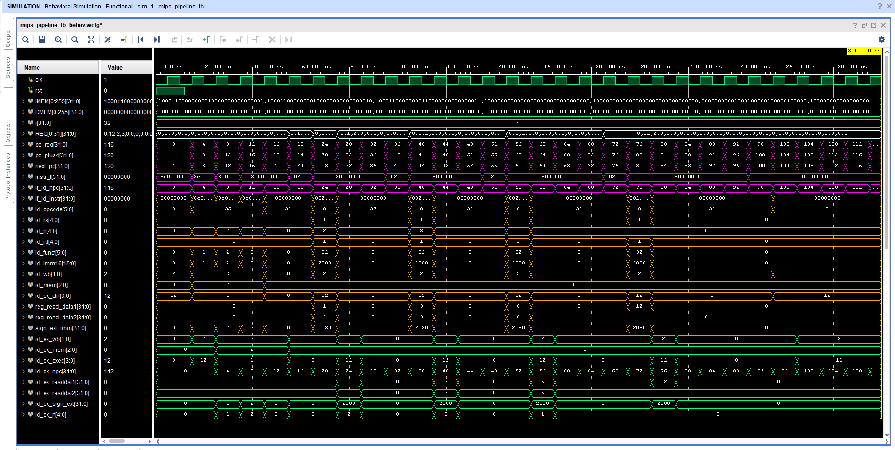

# ECE 4300 Coding Assignment 5: The Full Pipeline

.v Files:

ifIdLatch.v - passes on the output of incrementer.v and instrMem.v on every clock cycle  
incrementer.v - increments the output address of pc.v by 4 on every clock cycle  
instrMem.v - stores the "instructions", initializes an array of 2^10 32-bit registers, populates the first 10 entries with dummy instructions, then outputs the data from an input address from pc.v on every clock cycle.  
mux.v - simple 2x1 mux, uses the ex_mem_pc_src input to select between passing on the address to branch to or the next address in the sequence.  
pc.v - program counter, simply forwards the next address from the mux.  
top.v - top module, wires everything together.  

control.v: This segment interprets the wb, mem, ex signals and generates signals for them.
idExLatch.v: Acts as register for the the pipeline between the ID and EX stages.
signExt.v: Preforms a sign extension which increases the bits needed for the 16 bit input.
regfile.v: Register file that stores 32 bits in MIPS and writes registers.
Decoder.v: The main decoder for the whole code that handles the main outputs for the process.

Adder.v : 32 bit adder
Alu.v : performs arithmetic operations based on alu control
Alu_Control.v : tells the ALU what operation to perform
Ex_Mem_latch.v: passes the output onto the next stage
Execute.v : top module wiring everything together

MemAndWB.v - top module containing memory and wb stages
WBMux.v - Write back stage multiplexer
and.v - and module comparing membranch and zero
data.txt - memory that is read on startup
data_memory.v - module containing the program's memory and read/write functionality
mem_wb.v - output latch
memory.v - top module for memory stage
memory_tb.v - test bench testing memory stage

instr.txt

  

